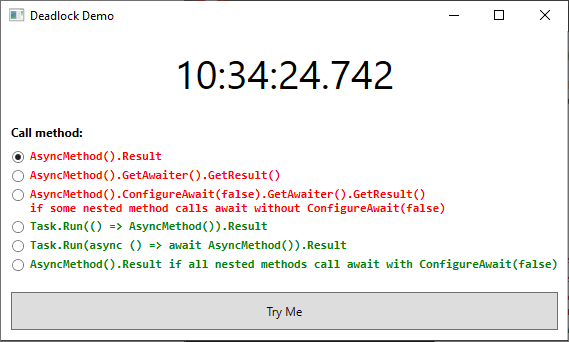

## Deadlock Demo

This project demonstrates different approaches for calling asynchronous methods from synchronous code.

The following approaches cause deadlock:

- `AsyncMethod().Result`
- `AsyncMethod().GetAwaiter().GetResult()`
- `AsyncMethod().ConfigureAwait(false).GetAwaiter().GetResult()` if some nested method calls `await` without `ConfigureAwait(false)`

The following approches work correctly:

- `Task.Run(() => AsyncMethod()).Result`
- `Task.Run(async () => await AsyncMethod()).Result`
- `AsyncMethod().Result` if **all** nested methods call `await` with `ConfigureAwait(false)`

Related info:

1. [ConfigureAwait FAQ](https://devblogs.microsoft.com/dotnet/configureawait-faq/)
2. [How to call asynchronous method from synchronous method in C#?](https://stackoverflow.com/questions/9343594/how-to-call-asynchronous-method-from-synchronous-method-in-c)
3. [Don't Block on Async Code](https://blog.stephencleary.com/2012/07/dont-block-on-async-code.html)
4. [Async Programming - Brownfield Async Development](https://docs.microsoft.com/en-us/archive/msdn-magazine/2015/july/async-programming-brownfield-async-development)
